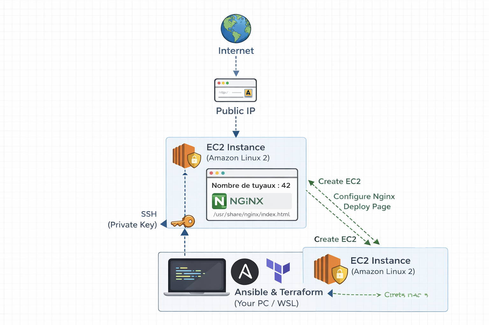
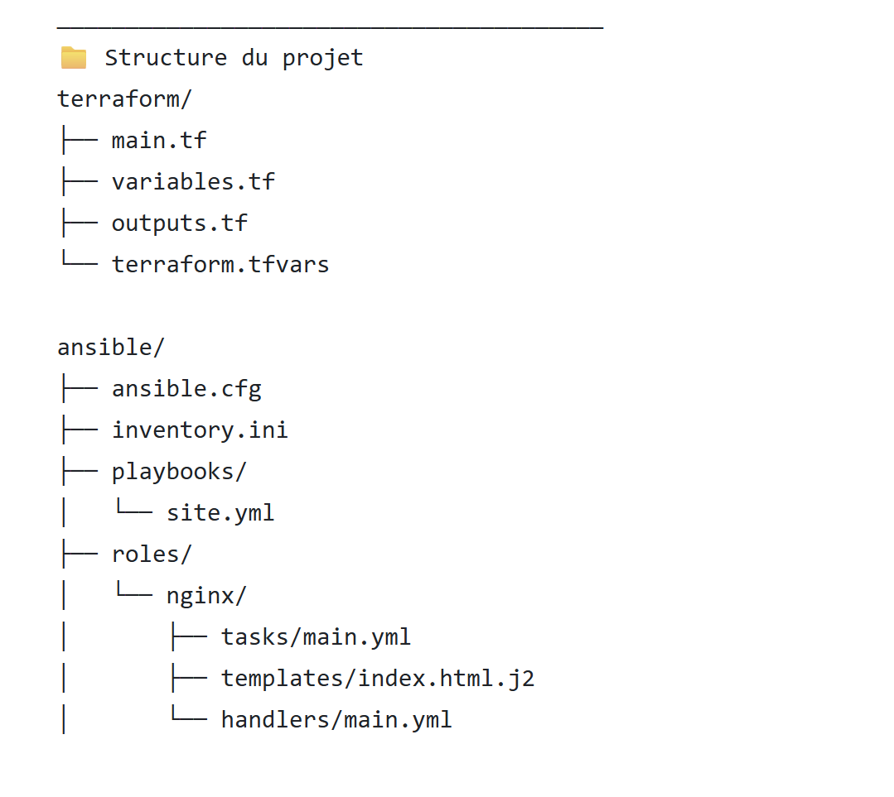

DevOps Lab – Terraform + Ansible (AWS EC2 + Nginx)

📌 Description

Ce projet démontre la mise en place d’une chaîne d’automatisation complète en utilisant :
•	Terraform pour le provisioning de l’infrastructure AWS
•	Ansible pour la configuration des serveurs
L’objectif est de déployer automatiquement une instance EC2 sur AWS et d’y installer un serveur web Nginx affichant une page personnalisée.
________________________________________
🧱 Architecture

devops-lab/

├── terraform/        # Infrastructure AWS (EC2, Security Group)
└── ansible/          # Configuration serveur (Nginx)

  

________________________________________
⚙️ Technologies utilisées
•	AWS EC2
•	Terraform
•	Ansible
•	Nginx
•	SSH
________________________________________
🚀 Fonctionnalités
•	Provisioning automatique d’une instance EC2
•	Gestion des accès via clé SSH
•	Configuration automatisée avec Ansible
•	Utilisation de roles Ansible (best practice)
•	Déploiement d’une page web via template
________________________________________

📁 Structure du projet

  

________________________________________
▶️ Déploiement

Provisioning de l’infrastructure

1. cd terraform
  
2. terraform init
 
3. terraform apply
________________________________________
 Configuration avec Ansible
   
cd ../ansible

ansible-playbook playbooks/site.yml
________________________________________
🌐 Résultat

Une fois le déploiement terminé, accéder à : http://<PUBLIC_IP>

Affichage : Nombre de tuyaux : 42
________________________________________
🧠 Concepts DevOps appliqués

•	Infrastructure as Code (IaC)
•	Configuration management
•	Séparation infra / config
•	Automatisation complète
•	Réutilisabilité via roles
________________________________________
🔐 Sécurité

•	Utilisation de clés SSH
•	Accès contrôlé via Security Groups
•	Fichiers sensibles exclus via .gitignore
________________________________________
💡 Améliorations possibles

•	Variables dynamiques (pipe_count)
•	Multi-environnements (dev / prod)
•	Génération automatique de l’inventory depuis Terraform
•	Intégration CI/CD (GitHub Actions)
•	Utilisation d’Ansible Vault
________________________________________
🧑‍💻 Auteur

Projet réalisé dans le cadre d’un lab DevOps visant à maîtriser Terraform et Ansible sur AWS.
________________________________________
