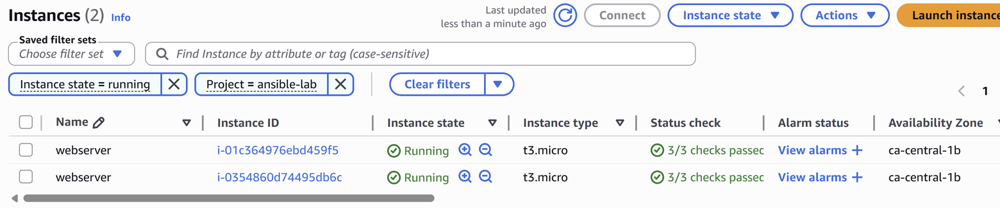

# AWS + Ansible Dynamic Inventory Lab

## 🎯 Objective
Deploy and manage EC2 instances dynamically using Ansible and AWS tags.

---

## 🏗️ Architecture
- 2 EC2 instances (web servers)
- Dynamic inventory using AWS plugin
- Optional: Terraform provisioning

---

## ⚙️ Stack
- AWS EC2
- Ansible
- Python (boto3)
- Terraform (optional)

---

## 🔑 Key Concepts
- Dynamic inventory (`amazon.aws.aws_ec2`)
- Tag-based filtering
- Python virtual environment (venv)
- SSH connectivity

---

## 🖥️ AWS EC2 Instances (Tag Filtering)

The EC2 instances are filtered using:
- Instance state = running  
- Tag: `Project = ansible-lab`

This ensures Ansible dynamically targets only the relevant infrastructure.



---

## 🚀 Setup

```bash
python3 -m venv venv
source venv/bin/activate
pip install ansible boto3 botocore
```

---

## 📁 Inventory Configuration

```yaml
plugin: amazon.aws.aws_ec2

regions:
  - ca-central-1

filters:
  instance-state-name: running
  "tag:Project": "ansible-lab"

compose:
  ansible_host: public_ip_address
```

---

## 🧪 Validate Inventory

```bash
ansible-inventory --graph
```

Expected output:

```
@aws_ec2:
  |--54.xxx.xxx.xxx
  |--52.xxx.xxx.xxx
```

---

## 🔌 Test Connectivity

```bash
ansible all -m ping -u ubuntu --private-key ~/.ssh/key.pem
```

---

## ⚠️ Challenges & Fixes

During this lab, several real-world issues were encountered:

- YAML parsing errors (duplicate keys)
- Incorrect field name (`public-ip` vs `public_ip`)
- Python environment mismatch (venv vs system Python)
- Missing boto3 dependency
- AWS tag filtering mismatch
- SSH authentication issues

---

## 💡 Key Takeaways

- AWS tagging is critical for automation
- Dynamic inventory depends on correct filters
- Environment consistency (venv) is essential
- Debugging is a core DevOps skill

---

## 🚀 Next Steps

- Add Terraform provisioning
- Extend playbooks for application deployment
- Integrate CI/CD pipeline
